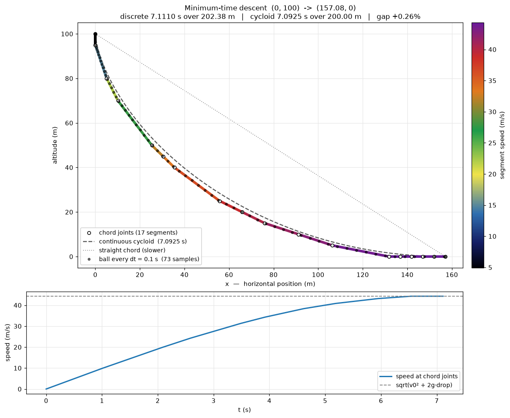
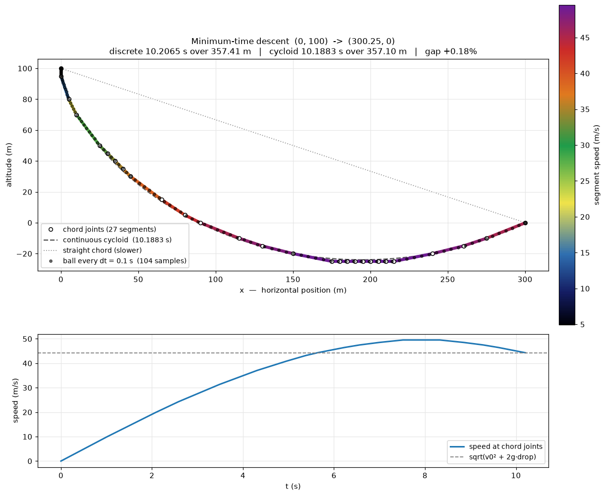
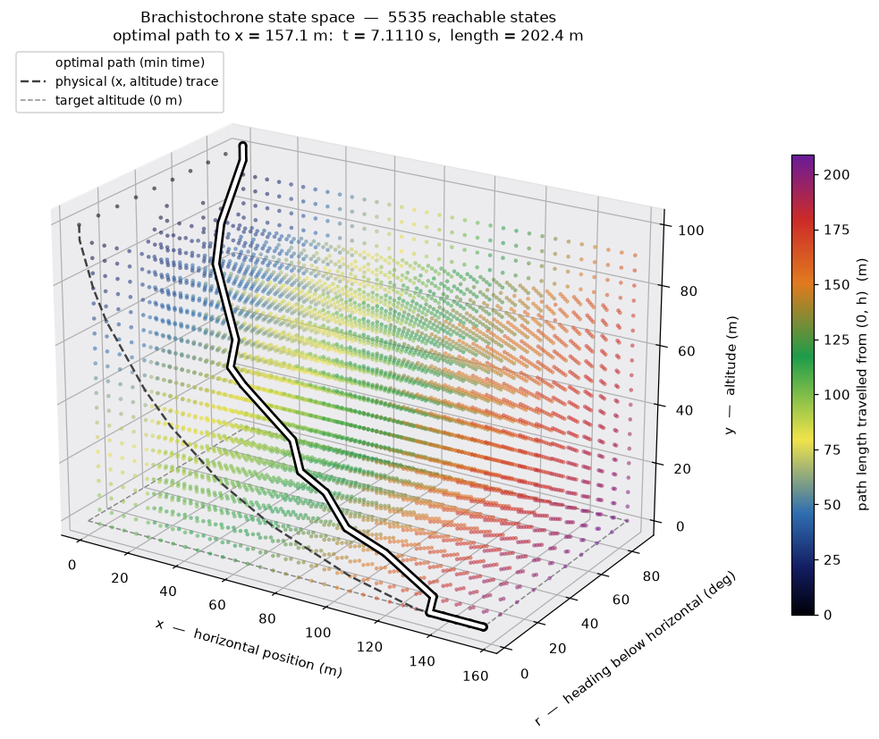
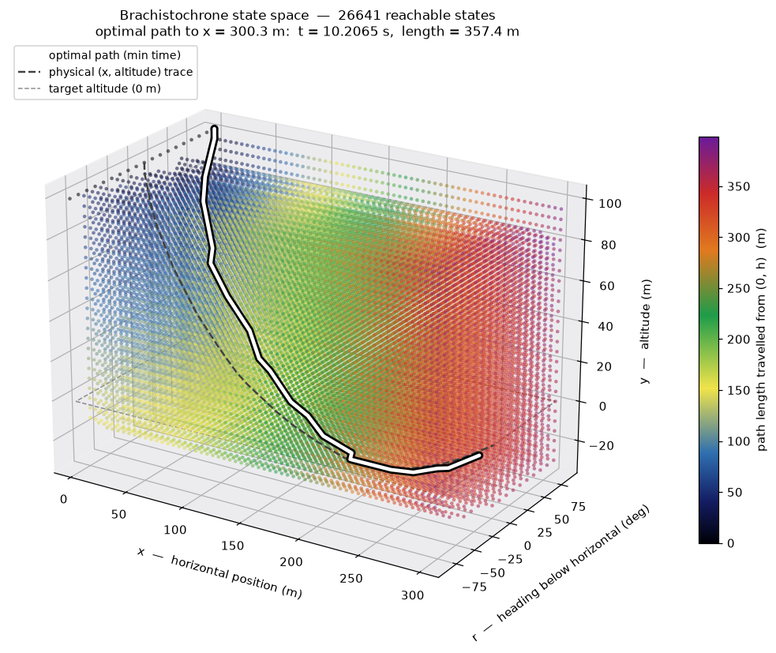

# Discrete Brachistochrone

Finds the **fastest** descent path for a ball sliding on a smooth, frictionless
track from height `h` to a configurable end altitude, under gravity `g`.

The continuous answer to this problem is the cycloid, known since Johann
Bernoulli posed it in 1696. This solves it *numerically*, by discretising the
plane into a grid and running a shortest-path search over it — which means the
same machinery extends to variants that have no closed form (curvature limits,
obstacles, a non-uniform field).

> **A note on "minimal distance".** The cost being minimised here is **time**,
> not path length. These are different optima and the distinction is the whole
> point of the problem: the cycloid is *longer* than the straight chord but
> arrives sooner, because it trades distance for early speed. Path length is
> tracked and reported alongside, but never optimised.

```bash
python brachistochrone.py                 # solve and print a summary table
python plot_states.py --curve             # 2D descent curve
python plot_states.py                     # 3D state space
python -m unittest test_brachistochrone   # 62 tests
```

Requires `numpy`; plotting requires `matplotlib`.

---

## The physical insight that makes it tractable

On a frictionless *constrained* path — a bead on a wire — energy conservation
fixes the speed from the altitude alone:

```
v(y) = sqrt(v0² + 2g(h − y))
```

**Independent of the route taken to get there.** This is the load-bearing fact
of the whole design. It means the cost of traversing a chord depends only on its
two endpoints, never on the history of how the ball arrived — exactly the
memorylessness a shortest-path algorithm requires.

Add friction and this collapses: speed would depend on accumulated path length,
edge weights would become history-dependent, and the problem would no longer be
a shortest-path search at all.

### Edge cost is exact, not a discretisation

Along a straight chord of length `L` dropping `Δy`, the tangential acceleration
`a = g·Δy/L` is **constant**. So:

```
v₂² = v₁² + 2aL = v₁² + 2gΔy     (consistent with energy conservation)
v₂  = v₁ + a·t
⟹   t = 2L / (v₁ + v₂)
```

No Taylor expansion, no time-stepping error. A polyline of grid chords is timed
*exactly*. The only approximation in the whole method is that the curve must
bend at grid nodes — which is why the computed time is always an **upper bound**
on the continuous optimum, and why it tightens monotonically as the grid refines.

---

## State space

A 3D array indexed `(ix, iy, ir)`:

| axis | meaning | default |
|---|---|---|
| `ix` | horizontal cell | 0 … 157.08 m, 32 columns |
| `iy` | altitude cell | 100 → 0 m, 21 rows |
| `ir` | heading of the velocity vector at that node | 0°…90°, 10 steps |

Four arrays of this shape carry the search: `time` (minimum arrival, init `∞`),
`length` (arc length of that path), `prev` (predecessor state), `settled`.

**Why position must be in the state.** Dynamic programming works by *merging*
paths that reach the same state and discarding all but the best. Only a
position-keyed state lets two different routes collide and be compared. A
state space indexed by time and launch angle can enumerate trajectories but
never merges them, so it prunes nothing and degenerates into exhaustive search.

**Why speed is not in the state.** It's a function of `iy` alone (see above), so
carrying it would be redundant.

**What `ir` is for.** The heading is only load-bearing when `max_turn_deg` is
set, where it forbids kinked paths. With no turn limit the `r` axis is fully
decoupled and every launch angle yields an identical optimum — which is a
useful self-check, and is asserted in the test suite.

### Horizontal extent

`x_max` defaults to `π·drop/2` = 157.08 m, derived geometrically rather than
guessed. The cycloid's lowest point is at `θ = π`, where the drop is `2a` and
the offset is `aπ`; setting `2a = drop` gives the bound. For any endpoint
farther out, the fastest path *must* dip below the target altitude — see
[Paths below the target](#paths-below-the-target).

A naive alternative — max speed × time budget = `2T·sqrt(2gh)` ≈ 443 m — is
2.8× larger and bounds a fiction: it assumes the ball travels at its terminal
speed for the entire descent, when it only reaches that speed at the very bottom.

---

## The dynamic programming steps

**1 — Precompute the move set.** The grid is uniform, so a step's geometry is
identical at every node. 35 raw offsets in a 5×5 neighbourhood collapse to
**21 primitive chords**: offsets with `gcd(dj, di) ≠ 1` are dropped, because a
`(2,2)` move is collinear with two `(1,1)` moves and costs *exactly* the same
under `t = 2L/(v₁+v₂)`. Dropping them is lossless, not an approximation. Each
surviving chord caches its length and its destination heading bin.

**2 — Precompute the speed column.** One array `speed[iy]` from energy
conservation, computed once.

**3 — Seed.** Every heading bin at cell `(0,0)` gets `time = 0`. Seeding all of
them is what makes the result the globally fastest path over all launch angles.

**4 — Relax.** For each settled state, for each of the 21 chords:

```python
t_next = t + 2·seg_len / (speed[i] + speed[ni])
if t_next < time[nj, ni, ir_next]:
    time[nj, ni, ir_next]   = t_next
    length[nj, ni, ir_next] = len_here + seg_len   # carried, not optimised
    prev[nj, ni, ir_next]   = (j, i, ir)
```

**5 — Extract.** `best_at(ix, iy)` takes the `argmin` over headings;
`path_states` / `path_nodes` / `path_segments` walk `prev` backwards to the
`-1` sentinel at the start.

One degenerate case is handled explicitly: a horizontal chord off the start
point has `v₁ + v₂ = 0`, so rather than dividing by zero it is skipped and the
state correctly stays unreachable.

---

## How Dijkstra finds the minimum-time path through the matrix

The relaxation in step 4 needs a *visiting order*. Process states in the wrong
order and you relax an edge out of a node whose own arrival time is still
provisional, so the value you write is based on a stale premise and has to be
redone later. Dijkstra supplies an order in which that never happens.

### The matrix viewed as a graph

Nothing is built beyond the arrays themselves — the graph is implicit:

- **Nodes** are the `(ix, iy, ir)` cells of the matrix. 6720 at defaults.
- **Edges** are the 21 precomputed chords, applied at every node. An edge from
  `(j, i, ir)` lands at `(j+dj, i+di, ir_next)`, where `ir_next` comes from the
  *chord's* own geometry — not from the source's heading.
- **Edge weight** is the traversal time `2L / (speed[i] + speed[ni])`.

The crucial property: that weight depends only on the two altitude rows, both
known upfront. So the graph is fully determined before the search starts, and
never has to be materialised — the 21 moves are re-applied at each pop.

### Why the ordering is valid

Two facts license Dijkstra here:

1. **Every edge weight is strictly positive.** `2L/(v₁+v₂) > 0` for any
   traversable chord. This is exactly Dijkstra's precondition. It holds whether
   the chord descends *or climbs* — a climb is simply a deceleration, still
   taking positive time.
2. **Therefore the smallest tentative time in the queue is final.** Any path
   that could still improve it would have to arrive via some other state, and
   every such state has a tentative time at least as large, plus a positive edge
   on top. So no future discovery can undercut it.

Fact 2 is the whole argument. It's why a state can be marked `settled` on pop
and never revisited, which is what makes the search linear-ish rather than
exponential in the number of paths.

### The loop

```python
heap = [(0.0, 0, 0, ir) for ir in seeds]      # every launch heading at t = 0

while heap:
    t, j, i, ir = heapq.heappop(heap)          # smallest tentative time
    if settled[j, i, ir]:
        continue                               # lazy deletion — stale entry
    settled[j, i, ir] = True                   # t is now final for this state

    for dj, di, seg_len, ir_next in moves:     # relax all 21 chords
        nj, ni = j + dj, i + di
        if out of bounds or settled[nj, ni, ir_next]:
            continue
        v_sum = speed[i] + speed[ni]
        if v_sum <= 0.0:                       # both ends at rest
            continue
        t_next = t + 2.0 * seg_len / v_sum
        if t_next < time[nj, ni, ir_next]:     # strictly better route found
            time[nj, ni, ir_next]   = t_next
            length[nj, ni, ir_next] = len_here + seg_len
            prev[nj, ni, ir_next]   = (j, i, ir)
            heappush(heap, (t_next, nj, ni, ir_next))
```

**Lazy deletion.** Textbook Dijkstra uses a decrease-key operation to update a
node's priority in place. Python's `heapq` has none, so instead a *second* entry
is pushed for the same state at the better time. The old entry is still in the
heap, but it sorts later, so by the time it is popped the state is already
settled and it's discarded by the `if settled: continue` guard. This trades a
larger heap for far simpler code, and is the standard idiom.

**The `settled` check inside the relaxation loop** is a pure optimisation — a
settled neighbour can never be improved, so the arithmetic is skipped entirely.

### A real trace

The first fourteen pops of the default run:

| pop | state | t_pop | alt | v here | action | improved | heap |
|---|---|---|---|---|---|---|---|
| 1 | (0,0,0) | 0.0000 | 100 | 0.00 | settle | 20 | 29 |
| 2 | (0,0,1) | 0.0000 | 100 | 0.00 | settle | 0 | 28 |
| … | … | 0.0000 | 100 | 0.00 | settle | 0 | … |
| 10 | (0,0,9) | 0.0000 | 100 | 0.00 | settle | 0 | 20 |
| 11 | (0,1,9) | 1.0096 | 95 | 9.90 | settle | 21 | 40 |
| 12 | (0,2,9) | 1.4278 | 90 | 14.01 | settle | 20 | 59 |
| 13 | (1,1,4) | 1.4375 | 95 | 9.90 | settle | 18 | 76 |
| 14 | (1,1,0) | 1.5212 | 95 | 9.90 | settle | 0 | 75 |

Several things are visible here:

- **Pops 2–10 improve nothing.** All ten launch-heading seeds sit at `t = 0`, so
  the first one claims every successor and the other nine find no *strictly*
  better route. This is the launch angle being inert in action — the same fact
  the test suite asserts independently.
- **Pop 11 is the first vertical chord**, 5 m straight down into heading bin 9
  (90°) at t = 1.0096 s. It becomes segment 0 of the final path.
- **Pop 14 improves nothing** despite being newly settled: every one of its
  successors already had a better time from elsewhere. Settling a state does not
  mean it contributes to any optimal path.

### Cost in practice

| | |
|---|---|
| states total | 6720 |
| states reachable | 5535 (1185 never reached) |
| heap pops | 8995 |
| — of which stale | 3460 (38.5%) |
| settled | 5535 |
| edges relaxed | 70,012 (of 141,120 possible) |
| — that improved something | 8985 (12.8%) |
| peak heap size | 1511 |

The first stale pop is #46: state (1,5,8) surfaces at t = 2.3035 s having
already been settled at t = 2.2970 s, and is discarded. At 38.5%, stale entries
are over a third of all pops — the price of lazy deletion, and still cheaper
than maintaining an indexed heap.

Only 12.8% of relaxations improve anything; the rest confirm an existing route
is already better. That ratio is the search doing its job — most of the state
space is reached optimally early and simply re-confirmed thereafter.

### Recovering the path

Dijkstra yields the minimum *time* to every state, but not the route. That's
what the `prev` array is for: each successful relaxation records which state the
edge came from. Reconstruction walks backwards from the target to the `-1`
sentinel planted at the start, then reverses:

```python
states = []
j, i, r = ix, iy, ir
while j >= 0:
    states.append((j, i, r))
    j, i, r = prev[j, i, r]
states.reverse()
```

`best_at(ix, iy)` picks the entry point by taking `argmin` over the ten heading
bins — the fastest arrival at that cell regardless of which way the ball is
pointing when it gets there. `path_states`, `path_nodes` and `path_segments` are
three views of the same walk.

### Why not a topological sweep

With descent-only moves, `di ≥ 0` makes the graph a DAG, and a sweep in altitude
order would compute the same answer without a heap — marginally faster, since it
avoids the 38.5% stale-pop overhead.

Dijkstra is used anyway because it survives the extension: enabling climbing
moves (`di < 0`) destroys the DAG property, and a topological order stops
existing. Dijkstra needs *no change at all*, because edge weights stay positive.
That's the difference between an algorithm chosen for the current constraints
and one chosen for the problem.

---

## 2D: the descent curve

```bash
python plot_states.py --curve
```



The upper panel is the physical `(x, altitude)` track. Each chord is drawn as
its own segment coloured by traversal speed, so the piecewise construction stays
visible rather than blending into a smooth line. Overlaid: the continuous
cycloid (dashed), the straight chord (dotted — shorter but slower, which is the
point), and the ball's position every `dt`.

The lower panel is speed against time, asymptoting onto `sqrt(v0² + 2g·drop)`.
It's a check as much as a plot: speed must lie on that curve whatever the route.

Three things worth reading out of the segments:

- **The first chord is vertical** — 5 m straight down at 90°, taking 1.01 s.
  That's 14% of the total time for 2.5% of the length. Banking speed early is
  the entire brachistochrone insight.
- **The heading shallows monotonically**, 90° → 71° → 63° → … → 0°, never
  reversing.
- **The last five segments are flat runs** along the floor at a constant
  44.29 m/s. Once at `y = 0` the ball has all the speed it will get, so the
  remainder is coasting.

Per-chord data is available as a structured array via `Solution.path_segments()`
or `--segments-csv`. Summing its `dt_seg` column reproduces the reported minimum
to machine precision — these are literally the edges Dijkstra relaxed.

### Paths below the target

Whether the lowest point falls *before* the endpoint depends on how far out the
endpoint is. The cycloid's minimum is always at `θ = π`, so:

| θ/π | x_end | lowest point |
|---|---|---|
| 0.521 | 60.00 m | at the endpoint |
| 1.000 | 157.08 m | at the endpoint (exactly — the threshold) |
| 1.117 | 200.11 m | 3.4 m below, at x = 162.5 |
| 1.290 | 300.25 m | 23.9 m below, at x = 194.7 |

```bash
python plot_states.py --theta-ratio 1.29 --curve
```



Past the threshold the solver needs grid headroom below `y_end` and upward
moves (40 primitive chords instead of 21). Dijkstra itself needs no change.
Note the speed profile now *overshoots* the free-fall reference and comes back:
energy is conserved, and the dip is a loan repaid in full on the climb. It pays
off because the extra speed is banked across the long horizontal stretch.

---

## 3D: the state space

```bash
python plot_states.py
```



Every reachable `(ix, iy, ir)` state as a point, coloured by the arc length of
the minimum-time path reaching it — black/navy at the start, through yellow,
green and red to purple at the farthest. The optimal path is overlaid in white
on a black underlay (readable against every colour in the ramp), with a dashed
shadow on the `r = 0` wall giving the physical trace.

Plot axes put altitude on the vertical so the picture reads physically:
`plot X ← x`, `plot Y ← r`, `plot Z ← y`. The ten discrete planes are the
heading binning — that's the state space itself, not a rendering artefact.

Drag to rotate azimuth and elevation; the three sliders give explicit control of
all three angles including **roll**, which the mouse cannot reach.

```bash
python plot_states.py --theta-ratio 1.29
```



With climbing enabled the heading axis becomes signed (−90°…90°, 19 bins) so
ascending chords get honest negative angles, and the grid extends below the
target altitude — marked by the dashed rectangle.

---

## Accuracy

Validated against the closed-form cycloid at every endpoint:

| x_end (m) | discrete (s) | analytic (s) | error | length (m) |
|---|---|---|---|---|
| 0.00 | 4.5152 | 4.5152 | −0.00% | 100.00 |
| 25.34 | 4.6267 | 4.6216 | +0.11% | 103.64 |
| 50.67 | 4.9246 | 4.9168 | +0.16% | 114.05 |
| 101.34 | 5.8715 | 5.8573 | +0.24% | 149.17 |
| 157.08 | 7.1110 | 7.0925 | +0.26% | 202.38 |

The error is always **positive** — every grid polyline is an admissible path, so
it can never beat the continuous optimum. That one-sidedness is a test, not an
observation. Refining halves the error each time (0.179% → 0.085% → 0.043% at
θ/π = 1.29).

The vertical drop is reproduced *exactly* to machine precision, since a column
of vertical chords is timed by the closed form with no geometric approximation.

### Gravity does not change the answer

Running at `g = 98.1` gives a **bit-for-bit identical curve** — same nodes, same
17 chords — with every time divided by exactly `√10` and every speed multiplied
by it. Gravity factors out: the cycloid is fixed by `(θ − sin θ)/(1 − cos θ) =
x_end/drop`, pure geometry, and `g` only enters as a `1/√g` scalar on every
traversal. Scaling all costs by one positive constant cannot reorder the argmin.

Practically: **the optimal track shape is a property of the endpoints alone.** A
slide designed on Earth is still optimal on the Moon; it just runs slower.

---

## Command-line reference

Both scripts share the physical and grid options:

| flag | default | meaning |
|---|---|---|
| `--height` | 100.0 | start altitude (m) |
| `--end-altitude` | 0.0 | target altitude (m) |
| `--gravity` | 9.81 | g (m/s²) |
| `--dt` | 0.1 | output sampling interval (s) |
| `--v0` | 0.0 | initial speed (m/s) |
| `--x-step`, `--y-step` | 5.0 | grid spacing (m) |
| `--x-max` | derived | horizontal extent override |
| `--theta-ratio` | — | endpoint as θ/π; >1 dips below target |
| `--depth-below` | derived | grid headroom below target (m) |
| `--neighbourhood` | 5 | chord span in cells |
| `--max-turn` | none | heading change limit (deg) |
| `--target` | far edge | endpoint to report/plot |

`plot_states.py` adds `--curve`, `--stride`, `--elev/--azim/--roll`, `--save`,
`--dpi`, `--segments-csv`. `brachistochrone.py` adds `--csv` for the dt-sampled
path.

For accurate dip *geometry* rather than dip *timing*, refine:
`--x-step 1.25 --y-step 1.25 --neighbourhood 7`.

---

## Limitations

- **Frictionless only.** Friction would make edge weights history-dependent and
  break the shortest-path formulation entirely.
- **Grid-restricted.** The optimum is the best polyline through grid nodes, not
  the true continuous curve. Always an upper bound.
- **Chord angular resolution** is set by `neighbourhood_cells`; the path can
  only take directions expressible as primitive cell offsets.
- **`--theta-ratio` is capped below 2.** As θ → 2π the arch flattens and `x_end`
  diverges.
- At the default grid the discrete path touches down early (x = 131.74 m rather
  than 157.08 m) and coasts flat, because 5 m cells cannot resolve the final
  shallow metres of the cycloid's approach. Most of the +0.26% gap comes from
  this. Refining moves the touchdown rightward.

## Layout

```
brachistochrone.py        solver, state space, analytic references, CLI
plot_states.py            2D curve and 3D state-space plots
test_brachistochrone.py   62 tests
docs/images/              figures used by this README
```
